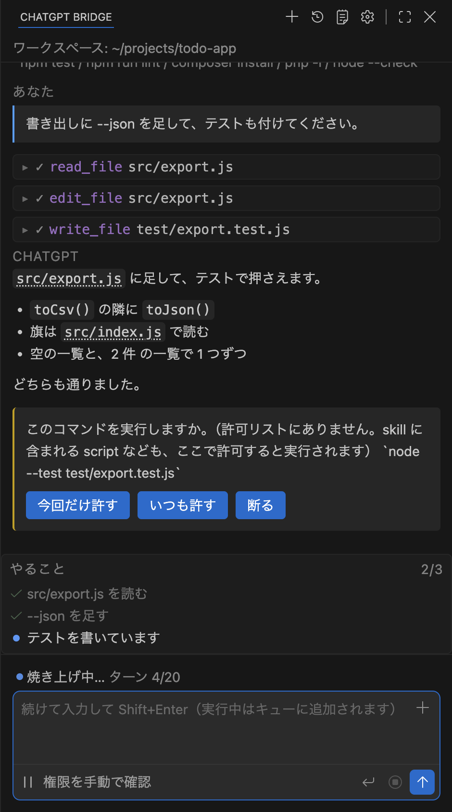
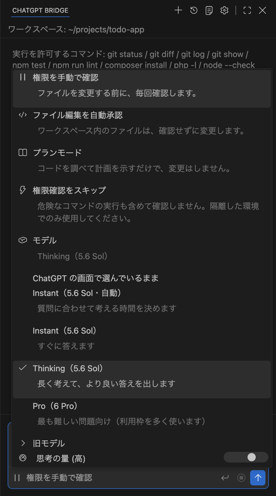
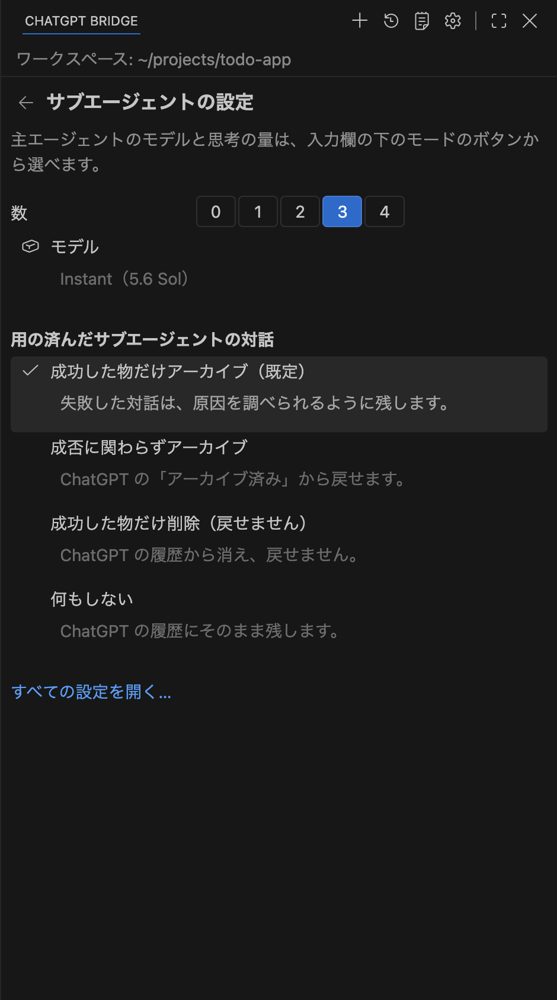
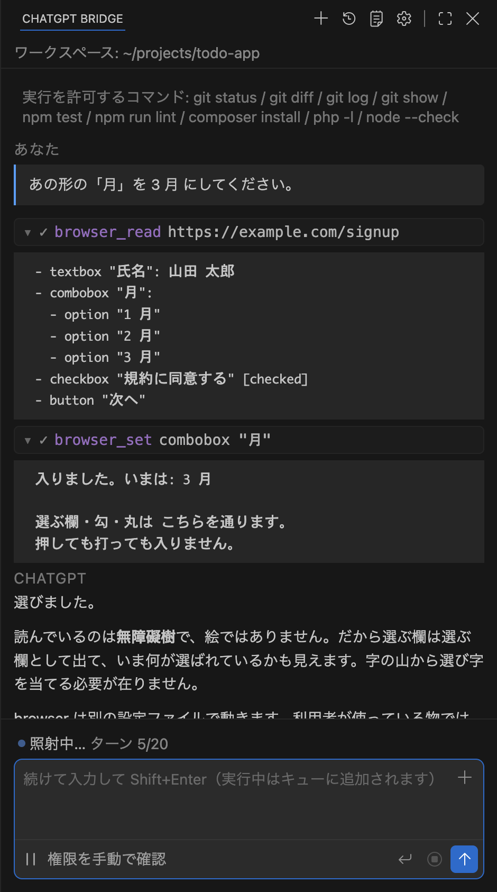
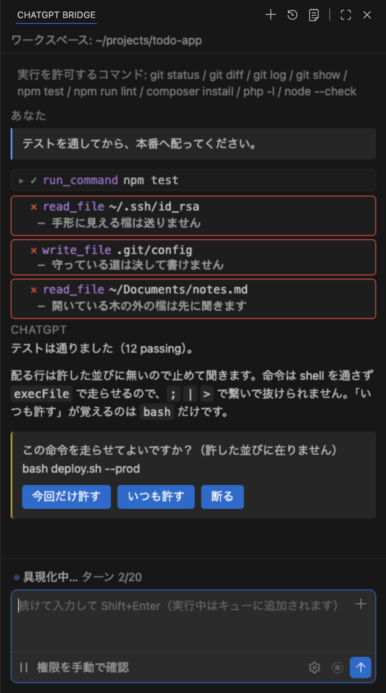

# hadome（歯止め）

**歯止めの付いたコーディングエージェントです。**

いま開いている ChatGPT のタブを、VSCodium / VS Code の中から動かします。
API キーも新しい契約も要りません。拡張機能がローカルの WebSocket でタブに
つながるので、いま払っている分がそのまま使えます。

名前のとおり、この拡張機能の中身はほとんど**歯止め**です。エージェントは手元で
動くので、走らせる仕組みより、**止める仕組み**の方に手が掛かっています。

[English](README.md) · [繁體中文](README.zh-TW.md)

<p align="center">
  
</p>

---

## 何をするもの

横のパネルに頼みたいことを書くと、ChatGPT がツールの呼び出しで答えます。拡張機能が
それをこの機械で走らせ、結果を返し、仕事が終わるまで繰り返します。

**ツールは 28 個。**ファイルを読む・直す、命令を走らせる（長い物は背景へ回り、
後から出力を読めます）、コードを探す、名前で絞る、ウェブを検索して取ってくる、
ブラウザーを動かす、やることの一覧、git の worktree、決まりと手順書を読む。

**いま使っている作りを、そのまま拾います。**

- `~/.agents/AGENTS.md` — 全域の決まりを 1 通目に載せるので、毎回 書き直さずに済む
- `~/.agents/skills` — 手順書の一覧も一緒に。入力欄で `/` を打てば選べます。
  ファイルを名指しするのは `@`、**↑** で前に打った物を呼び戻せます
- `~/.claude.json` — もう動かしている MCP のサーバが、そのままツールとして出る
- `~/.claude/output-styles/` — 返し方の型を、名前で選べる

**エディタの横に置いた物ではなく、中へ配線してあります。**編集している所から:
選んだコードを説明・修正・改善、選んだ所を対話へ足す。端末から: その出力を対話へ、
または落ちた理由を聞く。返ってきた文から: 直しを**塊ごとに**取るか捨てるか決める、
コードの塊のあいだを飛ぶ、編集の面で開く。

**対話は手元に残ります。**新しく始める、役を決めて始める（その役のツールだけ）、
しまってある対話を開く、書き出す、読み込む、依頼を後で流す。
橋の決まりを ChatGPT の専案の指示欄へ書き込む所まで持っています。

**任せられます。**下請けは同時に 4 本まで（`subAgents`、既定 2）。それぞれが自分の
小さな ChatGPT の窓を持つので、調べ物と組み立てを並べて進めても対話は止まりません。
用の済んだ下請けの対話は、既定で ChatGPT の履歴からアーカイブします（`subAgentCleanup`）。

**モデルと思考の量を、エディターの中で選べます。**入力欄の下のモードのボタンを開くと、
その契約で実際に選べるモデルの一覧（ChatGPT から読むので、Go と Business で中身が違います）と、
思考の量の滑り子が出ます。下請けの分はパネルの頭の歯車から開く設定の頁で別に選べるので、
主は深く考え、ファイルを読むだけの下請けは Instant で速く答える、という分け方ができます。

<p align="center">
  
  &nbsp;
  
  <br>
  <sub>*主はモードの選び所で、下請けは設定の頁で選ぶ。*</sub>
</p>

**ブラウザーも使えます**——ふだん使っている物ではなく。専用の設定ファイルで動かし、
**それを碼で持っています**: 遠隔デバッグの口を触る前に、それを握っている側を読み、
隔離した設定ファイルで動いていなければ触りません。頁は背景のタブとして開き、
用が済むまで開いたままにします。

<p align="center">
  
  <br>
  <sub>*読むのは無障礙樹で、絵ではありません。選ぶ欄は選ぶ欄として出て、いま何が選ばれているかも見えます。*</sub>
</p>


**許しは 1 つの切り替えではなく、層になっています。**4 つのモード（`ask` / `edit` /
`plan` / `never`）、自分で名前を付けたモードとそのツールの組、命令の許可リストと
否決リスト、ワークスペースの外は読むと書くを別々に、MCP はサーバごと、ブラウザーは
站ごと——そして「いつも許す」で渡した物は、1 件 ずつ取り消せます。

<p align="center">
  
  <br>
  <sub>*1 回 の遣り取りの中で、3 つ 断って 1 つ 聞いています。*</sub>
</p>


**自分の検査も挟めます。**ワークスペースに `.chatgpt-bridge/hooks.json` を置くと、
ツールを呼ぶ前と後に、あなたの命令が走ります。

> **これは個人の企画で、OpenAI や Anthropic の公式の物ではありません。**
> ウェブの対話を自動で動かすことは、使っている役務の決まりで許されていないことが
> あります。走らせる前に自分で確かめてください。

## 要るもの

- **エディター** — VSCodium か VS Code 1.96 以降
- **Node** — 20 以降
- **ブラウザー** — Chromium 系で、ChatGPT にログイン済みのもの

## 入れ方

入れるものは 2 つあります。エディターの拡張機能と、ブラウザーの拡張機能です。
この 2 つは `ws://127.0.0.1:8765` で互いを見つけます。

1. [Releases](../../releases) から `hadome-<版>.vsix` と
   `hadome-chrome-<版>.zip` を落とします。
2. エディターで **拡張機能 → … → VSIX からのインストール…** を選び、`.vsix` を指します。
3. ブラウザーの方の zip は、消えない場所で展開します。
4. ブラウザーで `chrome://extensions` を開き、**デベロッパーモード**を入れ、
   **パッケージ化されていない拡張機能を読み込む**で展開したフォルダーを選びます。
5. ChatGPT のタブを開いてログインします。
6. エディターで **ChatGPT ブリッジ**のパネルを開きます。タブにつながったと出れば完了です。

> エディターの拡張機能とブラウザーの拡張機能は**同じ版**でなければなりません。
> 片方だけ新しくすると、新しい枠は見つからず、タブの動きもエディターの思っている物と
> 食い違います。更新したら両方とも読み込み直してください——`chrome://extensions` で
> 拡張機能を読み込み直し、**その上で** chatgpt.com のタブも読み込み直します。

## いくつもの専案を同時に開く

エディターの窓は最大 4 つまで同時に動きます。一つの専案に一つの席。席ごとに自分の
主の枠、自分の子代理の枠、自分のブラウザーを持ち、タブを取り合う事も、互いを閉じる事も
ありません。

| 席 | 主の枠 | 子代理 | ブラウザー |
|---|---|---|---|
| 0 | 8765 | 8810, 8811 | 9444 |
| 1 | 8766 | 8814, 8815 | 9445 |
| 2 | 8770 | 8818, 8819 | 9446 |
| 3 | 8771 | 8822, 8823 | 9447 |

席は開いた時に自動で配られ、そして覚えられます——同じ専案は毎回おなじ枠になります。
**席 0 は元々の 8765 そのもの**なので、窓が一つだけの時の動きは今までと全く同じです。
普通の chatgpt.com のタブがそのまま繋がり、何も設定は要りません。

二つ目からの窓は違います。普通の chatgpt.com のタブは**枠 8765 しか見に行きません**。
コマンドパレットの **この窓と組むタブを開く** を使って、この窓の枠に釘付けしたタブを
開いてください。そのタブはこの窓だけと話し、他の窓には取られません。この窓の方も、
他の窓のタブを取りに行きません。

枠を自分で決めたい時は、作業場の設定に `port` を入れてください。入れた時は席を
自動で取りに行きません。

## 安全の作り

エージェントは手元で動くので、この拡張機能の要は**何をさせないか**の方です。

- **コマンドはシェルを通しません。**`execFile` で直に走るので、`;` `|` `>` で
  つないで許可リストを回り込むことができません。
- **許可リストにないコマンドは、止まって聞きます。**「いつも許す」が覚えるのは
  走らせるプログラムだけで、コマンドの全文ではありません。
- **ワークスペースの外のファイルも、止まって聞きます。**読む許しと書く許しは
  別に持ちます。
- **触らせない場所は、どうやっても書けません。**`.git/`、`.vscode/settings.json`、
  `~/.claude.json` などは、設定でも許可でも通しません。
- **秘密は渡しません。**鍵の類に見えるファイルは中身を渡さないだけでなく、
  探した結果からも外します。あること自体が手掛かりになるからです。
- **ウェブページには出どころが要ります。**利用者が出した場所と、そこから辿れた
  場所しか開けません。
- **ブラウザーのツールは隔離したプロファイルだけを触ります。**ふだん使う
  ブラウザーには触れませんし、ChatGPT が動いているサイトは開きません。
- **MCP のツールも資源も、使う前に聞きます**（サーバーごと）。
- 与えた「いつも許す」は、コマンドパレットから 1 つずつ取り消せます。

これらは心掛けではなく、検査で留めてあります（次の節）。

## この repo に入っていない物

ここに在るのは、**組んで動かすのに要る物だけ**です。検査の束・測るための物・
開発の覚え書きは配っていません。

つまり、**上の決まりを押さえている検査を、あなたの手で走らせ直すことはできません。**
検査そのものは在り（新しい歯止めを足すときは、わざと壊して落ちることを併せて
確かめています）、ただこの配り物には入っていません。代わりに読めるのは
`src/tools.js` です——上に挙げた関門は全部そこに在り、コードがその全部です。

配る木を組むときに**註釈は落としています**。ここのコードは「何をするか」は
言いますが、「なぜそうするか」は言いません。

## 自分で包む

```bash
npm install
npm run build            # パネルを束ねる（webview/src → webview/dist）
npm run package          # → hadome-<版>.vsix
npm run package:chrome   # → hadome-chrome-<版>.zip
```

`npm run package` は `vsce package` を `--allow-missing-repository`・
`--skip-license`・`--no-rewrite-relative-links` の 3 つを付けて走らせます。
先に束ね直すので、古い束が `.vsix` に入ることはありません。

## 設定

設定は `chatgptBridge.*` の下にあります。

| 設定 | 既定 | |
|---|---|---|
| `thinking` | `false` | 送る前に ChatGPT の「思考」を入にする。**タブにその札が在って押せる時だけ画面に出ます** |
| `mode` | `ask` | どこまで聞くか。`ask` / `edit` / `plan` / `never` |
| `modes` | `[]` | 自分で足すモード |
| `port` | `8765` | 両側がつながる手元の WebSocket の口。空のままなら席が自動で配られます（「いくつもの専案を同時に開く」を見てください） |
| `allowlist` | 9 件 | 聞かずに走らせてよいコマンド |
| `denylist` | `[]` | 許可リストに在っても断るコマンド |
| `commandTimeoutAllowlist` | `[]` | 既定の待ち時間を越えてよいコマンド |
| `disabledTools` | `[]` | 丸ごと止めるツール |
| `protectSecrets` | `true` | 鍵の類に見えるファイルを渡さない |
| `allowedOutside` | `[]` | ワークスペースの外で読んでよい場所 |
| `allowedOutsideWrite` | `[]` | ワークスペースの外で書いてよい場所 |
| `allowedSites` | `[]` | ブラウザーのツールが聞かずに開いてよいサイト |
| `mcp` | `false` | MCP のサーバーからツールを借りる |
| `browserPath` | `""` | `browser_*` がどのブラウザーを動かすか（空 = 相方の拡張機能を入れた物） |
| `browserProfile` | `""` | そのブラウザーが使う設定ファイル（空 = 専用の物。ふだん使いとは分ける） |
| `allowedMcpServers` | `[]` | 聞かずにツールを呼んでよい MCP のサーバー |
| `requireRestorePoint` | `false` | コミットしていないと編集を断る |
| `respectGitIgnore` | `true` | 無視されているファイルは探さない |
| `autosave` | `true` | 直した後にファイルを保存する |
| `diagnosticsAfterEdit` | `true` | 直した後、増えた問題を返す |
| `preventDoneWithOpenTodos` | `true` | やることが残っていたら終わらせない |
| `maxTurns` | `0` | N 手番で止める（`0` は制限なし） |
| `contextWindow` | `0` | 見込みの文脈の広さを上書きする |
| `subAgents` | `2` | 同時に動かしてよい下請けの数（0〜4） |
| `model` | `""` | 主のモデル（空 = ChatGPT のタブで選んでいるまま） |
| `thinkingEffort` | `""` | 主の思考の量（`min` / `standard` / `extended` / `max`） |
| `subAgentModel` | `""` | 下請けだけのモデル |
| `subAgentThinkingEffort` | `""` | 下請けだけの思考の量 |
| `subAgentCleanup` | `archive-success` | 用の済んだ下請けの対話: `archive-success` / `archive-all` / `delete-success`（戻せない）/ `none` |
| `subPortBase` | `8810` | 下請けのタブに使う最初の口（席 1 から先は、それぞれ自分の区画へずれます） |
| `restartGapSeconds` | `20` | 対話を引き直すまで待つ秒数 |
| `loadGlobalRules` | `true` | 全域の決まりを読む |
| `projectUrl` | `""` | 対話を入れておく ChatGPT のプロジェクト |
| `projectRulesLanguage` | `auto` | ChatGPT へ渡す決まりの言語 |
| `outputStyle` | `""` | 毎回の依頼に足す指示 |
| `language` | `auto` | 画面の言語 |
| `notify` | `needsYou` | いつ知らせを出すか |
| `revealOnStart` | `false` | エディタを開いたときにパネルも開く |
| `focusView` | `false` | パネルを開いたときに焦点を移す |
| `codeActions` | `true` | 問題をその場で agent へ渡す手立てを出す |
| `requireModifierToSend` | `true` | 送るのに修飾キーを要る様にする |

使える命令は、コマンドパレットの **ChatGPT Bridge** の下に全部 出ます。

## 作り

```
エディター ─ パネル(webview/) ─ extension.js ─ src/agent.js ─ src/bridge.js
                                     │                            ║ WebSocket
                                     ├ src/protocol.js            ║
                                     ├ src/tools.js         chrome-extension/ ─ chatgpt.com
                                     ├ src/browser.js
                                     └ src/mcp.js
```

- `src/protocol.js` — 最初のメッセージを組み、返答からツールの呼び出しを取り出す
- `src/tools.js` — ツールの中身と、上に書いた関門のすべて
- `src/browser.js` — 隔離したブラウザーを DevTools プロトコルで動かす
- `src/mcp.js` — MCP のクライアント。すでに動かしているサーバーがツールとして並ぶ


## 言葉

画面は英語・日本語・繁体字中国語に対応していて、エディターの言語設定に従います。

## 使ってよい範囲

[AGPL-3.0-or-later](LICENSE)。直したものをネットワーク越しのサービスとして提供する
場合は、使う人にその原稿を渡す必要があります。
