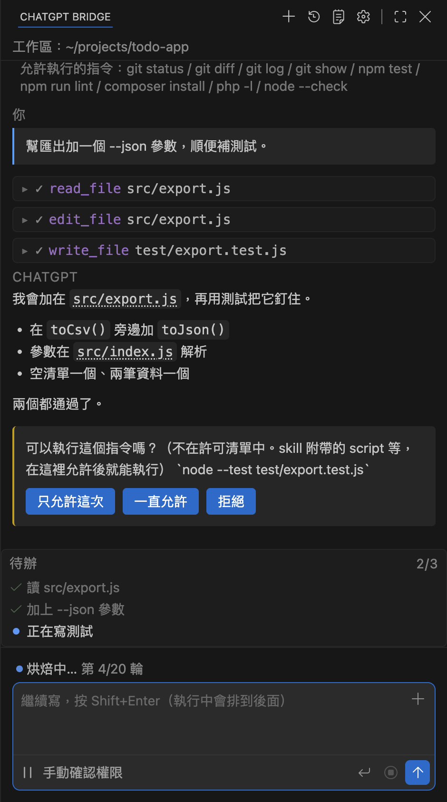
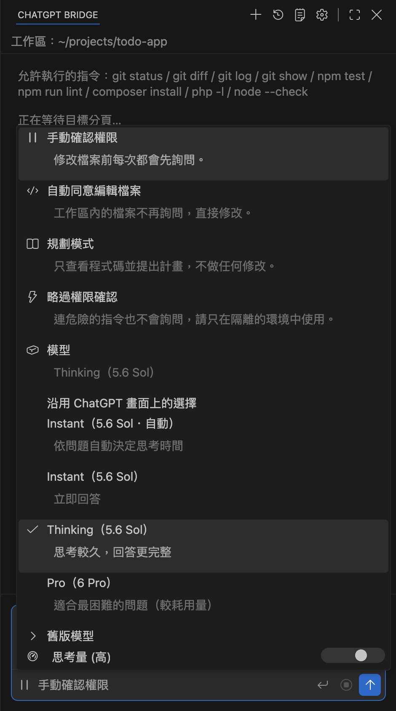
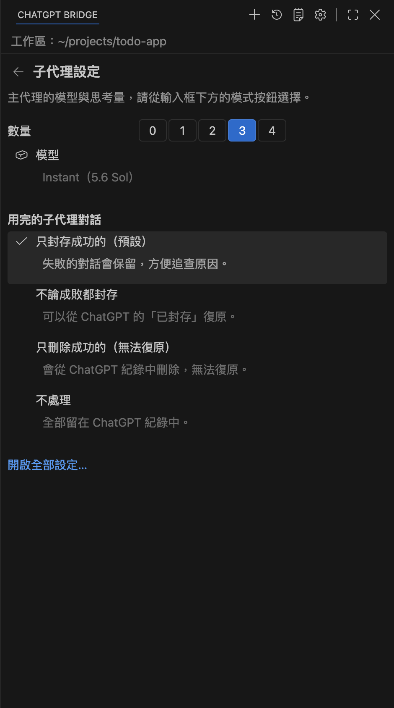
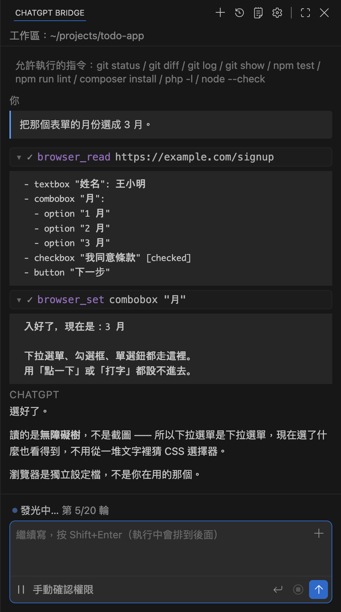
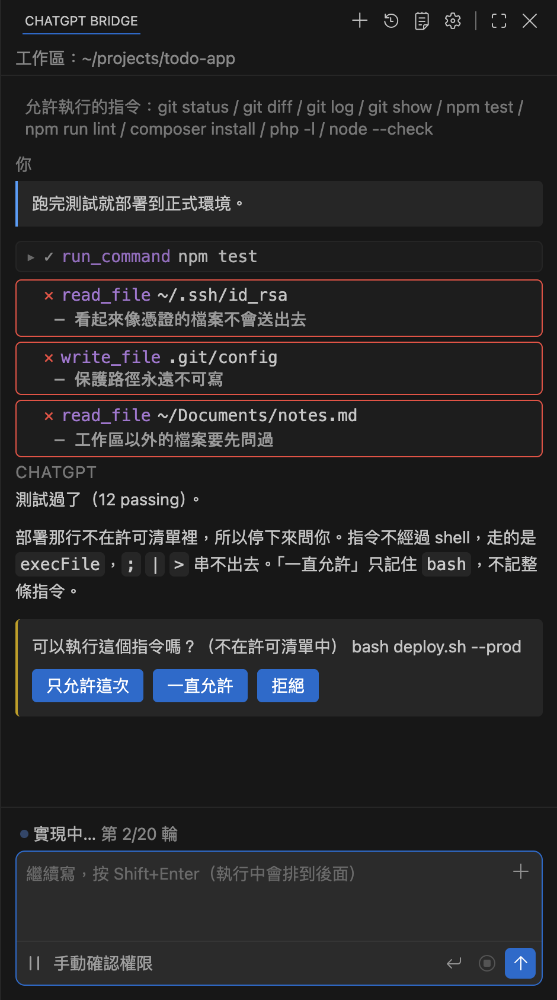

# hadome（歯止め）

**裝了煞車的編碼代理。**

它從 VSCodium / VS Code 裡面，去操作你已經開著的 ChatGPT 分頁。
不需要 API 金鑰，也不用再開一份訂閱——擴充功能透過本機的 WebSocket 連到那個分頁，
用的就是你現在已經在付的那一份。

*hadome*（歯止め）在日文是墊在車輪下的那塊楔子。這個專案大半就是那個東西：
代理跑在你自己的機器上，而煞車負責讓它留在那裡。

[English](README.md) · [日本語](README.ja.md)

<p align="center">
  
</p>

---

## 它做什麼

你在側邊面板寫下要做的事，ChatGPT 用工具呼叫回答。擴充功能在你的機器上執行那些呼叫、
把結果送回去，一直重複到事情做完。

**內建 28 個工具**：讀寫檔案、執行指令（跑很久的會轉到背景，之後還能讀它的輸出）、
搜尋程式碼、用名稱篩選、網路搜尋與抓取、操作瀏覽器、待辦清單、git worktree，
以及讀取你的規則與技能。

**它會直接沿用你現有的設定。**

- `~/.agents/AGENTS.md` —— 全域規則會放進第一則訊息，不必每次重打
- `~/.agents/skills` —— 技能清單也一起帶上。輸入框打 `/` 挑技能、`@` 指定檔案、
  **↑** 叫回之前打過的內容
- `~/.claude.json` —— 你已經在跑的 MCP 伺服器，直接變成可用的工具
- `~/.claude/output-styles/` —— 回覆風格，用名稱選

**它是接進編輯器裡的，不是擺在旁邊。**在編輯區：解釋、修正或改善選取的程式碼，
把選取加進對話。在終端機：把輸出丟進對話，或問它指令為什麼失敗。
在回覆上：逐塊決定要不要採納這個修改、在程式碼區塊之間跳、把某一塊開到編輯區。

**對話是你的。**開新對話、以指定角色開新對話（只帶那個角色的工具）、
開啟存起來的對話、匯出、匯入、把提示排到之後再跑。
它也能把橋自己的規則寫進 ChatGPT 專案的指示欄。

**它能分工。**子代理最多同時四個（`subAgents`，預設 2），各自在一個小小的 ChatGPT 視窗裡跑，
所以查資料和建置可以並行，主對話不會被卡住。用完的子代理對話預設會在 ChatGPT 裡封存，
對話紀錄不會越堆越亂（`subAgentCleanup`）。

**不用離開編輯器就能選模型和思考量。**打開輸入框下方的模式按鈕，會列出你的方案實際能選的模型
（直接從 ChatGPT 讀取，所以 Go 和 Business 看到的不一樣），還有思考量的滑桿。
子代理可以在面板上方齒輪打開的設定頁另外選，讓主代理想得深一點，
只負責讀檔的子代理用 Instant 快速回答。

<p align="center">
  
  &nbsp;
  
  <br>
  <sub>*主代理在模式選單選，子代理在設定頁選。*</sub>
</p>

**它能操作瀏覽器**——不是你平常用的那個。它跑在另外的設定檔上，**而且這是程式在擋的**：
碰除錯埠之前，它會先讀出握著那個埠的行程，確認跑在隔離設定檔上才連。
頁面以背景分頁開啟，做完之前不會關掉。

<p align="center">
  
  <br>
  <sub>*讀的是無障礙樹，不是截圖 —— 下拉選單是下拉選單，現在選了什麼也看得到。*</sub>
</p>


**權限不是一個開關，而是分層的。**四種模式（`ask` / `edit` / `plan` / `never`）、
你自己命名的模式與它能用的工具、指令的允許清單與拒絕清單、工作區以外的讀與寫分開管、
MCP 以伺服器為單位、瀏覽器以站台為單位——而且所有給出去的「總是允許」，
都能一項一項收回來。

<p align="center">
  
  <br>
  <sub>*同一次往返裡，擋了三個、問了一個。*</sub>
</p>


**你也能插入自己的檢查。**在工作區放一個 `.chatgpt-bridge/hooks.json`，
每次呼叫工具的前後就會執行你的指令。

> **這是個人專案，不是 OpenAI 或 Anthropic 的官方產品。**
> 自動操作網頁服務，未必符合該服務的使用條款。執行前請自行確認。

## 需要什麼

- **編輯器** — VSCodium 或 VS Code 1.96 以上
- **Node** — 20 以上
- **瀏覽器** — Chromium 系，而且已經登入 ChatGPT

## 安裝

要裝的有兩個：編輯器的擴充功能，和瀏覽器的擴充功能。兩邊靠
`ws://127.0.0.1:8765` 找到彼此。

1. 從 [Releases](../../releases) 下載 `hadome-<版本>.vsix` 和
   `hadome-chrome-<版本>.zip`。
2. 在編輯器選 **擴充功能 → … → 從 VSIX 安裝…**，指向那個 `.vsix`。
3. 瀏覽器那一包解壓到不會被刪掉的位置。
4. 在瀏覽器開 `chrome://extensions`，打開**開發人員模式**，選**載入未封裝項目**，
   指向剛才解壓的資料夾。
5. 開一個 ChatGPT 分頁並登入。
6. 回到編輯器打開 **ChatGPT Bridge** 面板，顯示已連上分頁就完成了。

> 編輯器擴充和瀏覽器擴充**必須是同一版**。只更新其中一邊的話，新的連接埠掃不到，
> 而且分頁的行為會和編輯器預期的不一樣。更新後兩邊都要重載：在 `chrome://extensions`
> 重新載入擴充功能，**而且**把 chatgpt.com 的分頁也重新載入。

## 同時開多個專案

最多 4 個編輯器視窗可以同時運作，一個專案一個席位。每個席位有自己的主連接埠、
自己的一段子代理連接埠、自己的一顆瀏覽器，彼此不互搶分頁也不互相關閉。

| 席位 | 主連接埠 | 子代理 | 瀏覽器 |
|---|---|---|---|
| 0 | 8765 | 8810, 8811 | 9444 |
| 1 | 8766 | 8814, 8815 | 9445 |
| 2 | 8770 | 8818, 8819 | 9446 |
| 3 | 8771 | 8822, 8823 | 9447 |

席位是開啟時自動分配的，而且會記住——同一個專案每次都拿到同一組連接埠。
**席位 0 就是原本的 8765**，所以只開一個視窗時，行為和以前完全一樣：
一般的 chatgpt.com 分頁照樣連得上，什麼都不用設。

第二個以後的視窗就不同了。一般的 chatgpt.com 分頁**只會去找 8765**，所以要用
命令選擇區的 **開一個與本視窗配對的分頁**，開出一個釘住本視窗連接埠的分頁。
那個分頁只跟這個視窗說話，不會被別的視窗叫走；這個視窗也不會去搶別人的分頁。

如果你想自己指定連接埠，把 `port` 設在工作區設定裡就好——設了就不再自動分配席位。

## 安全性

代理是在你自己的機器上跑的，所以這個專案真正要緊的是**不讓它做什麼**。

- **指令不經過 shell。**走的是 `execFile`，沒辦法用 `;` `|` `>` 串接來繞過允許清單。
- **不在允許清單裡的指令會停下來問你。**「總是允許」記住的是要執行的程式，
  不是整條指令。
- **工作區以外的檔案也會停下來問**，而且讀取和寫入分開記。
- **受保護的位置怎樣都寫不進去**——`.git/`、`.vscode/settings.json`、
  `~/.claude.json` 這一類，改設定不行，給了允許也不行。
- **不會送出機密。**看起來像金鑰的檔案不但不給內容，連搜尋結果裡也不會出現，
  因為「存在」本身就是線索。
- **開網頁需要來源。**只能開你貼過的網址，或是從你已經允許的頁面連過去的。
- **瀏覽器工具只碰隔離的設定檔**，不會動到你平常用的瀏覽器，也不會開 ChatGPT
  所在的站台。
- **MCP 的工具和資源，使用前都會問**（以伺服器為單位）。
- 給出去的「總是允許」，都能從命令選擇區逐項收回。

以上不是靠自律，是靠測試壓住的（見下一節）。

## 這個 repo 裡沒有的東西

這裡放的是**建置與執行需要的東西**。檢查套件、量測工具、開發筆記都沒有公開。

也就是說，**你沒辦法自己重跑那些把上面規則釘住的檢查。**檢查是存在的（每加一道護欄
都會故意弄壞一次，確認檢查真的會落），只是不在這份配布裡。你能做的是讀
`src/tools.js`——上面列的每一道關卡都在那裡，程式碼就是全部。

建配布樹的時候**註解會被整個拿掉**，所以這裡的程式碼說得出「做什麼」，說不出「為什麼」。

## 自己打包

```bash
npm install
npm run build            # 打包面板（webview/src → webview/dist）
npm run package          # → hadome-<版本>.vsix
npm run package:chrome   # → hadome-chrome-<版本>.zip
```

`npm run package` 會用 `--allow-missing-repository`、`--skip-license`、
`--no-rewrite-relative-links` 三個旗標跑 `vsce package`。它會先重新打包面板，
所以不會把過期的束塞進 `.vsix`。

## 設定

設定都在 `chatgptBridge.*` 底下。

| 設定 | 預設 | |
|---|---|---|
| `thinking` | `false` | 送出前先打開 ChatGPT 的「思考」。**只有分頁上真的有那顆按鈕、而且按得動時才會出現在畫面上** |
| `mode` | `ask` | 動作前問到什麼程度：`ask` / `edit` / `plan` / `never` |
| `modes` | `[]` | 自己加的模式 |
| `port` | `8765` | 兩邊相接的本機 WebSocket 連接埠。留著不設 = 自動分配席位（見「同時開多個專案」） |
| `allowlist` | 9 條 | 不用問就能執行的指令 |
| `denylist` | `[]` | 就算在允許清單裡也照樣拒絕的指令 |
| `commandTimeoutAllowlist` | `[]` | 可以超過預設等待時間的指令 |
| `disabledTools` | `[]` | 整個關掉的工具 |
| `protectSecrets` | `true` | 不送出看起來像金鑰的檔案 |
| `allowedOutside` | `[]` | 工作區外可以讀的資料夾 |
| `allowedOutsideWrite` | `[]` | 工作區外可以寫的資料夾 |
| `allowedSites` | `[]` | 瀏覽器工具不用問就能開的站台 |
| `mcp` | `false` | 借用 MCP 伺服器的工具 |
| `browserPath` | `""` | `browser_*` 要操作哪個瀏覽器（留空 = 你載入配套擴充套件的那個） |
| `browserProfile` | `""` | 那個瀏覽器使用的設定檔（留空 = 專用目錄，和你平常用的分開） |
| `allowedMcpServers` | `[]` | 不用問就能呼叫工具的 MCP 伺服器 |
| `requireRestorePoint` | `false` | 沒提交就拒絕編輯 |
| `respectGitIgnore` | `true` | 搜尋時跳過被忽略的檔案 |
| `autosave` | `true` | 改完檔案後自動存檔 |
| `diagnosticsAfterEdit` | `true` | 改完後把新增的問題回報回去 |
| `preventDoneWithOpenTodos` | `true` | 待辦還沒做完就不讓它結束 |
| `maxTurns` | `0` | 跑 N 回合就停（`0` 表示不限） |
| `contextWindow` | `0` | 覆寫假設的脈絡長度 |
| `subAgents` | `2` | 同時可以跑幾個子 agent（0～4） |
| `model` | `""` | 主代理的模型（空白 = 沿用 ChatGPT 分頁上選的） |
| `thinkingEffort` | `""` | 主代理的思考量（`min` / `standard` / `extended` / `max`） |
| `subAgentModel` | `""` | 只給子代理用的模型 |
| `subAgentThinkingEffort` | `""` | 只給子代理用的思考量 |
| `subAgentCleanup` | `archive-success` | 用完的子代理對話：`archive-success` / `archive-all` / `delete-success`（無法復原）/ `none` |
| `subPortBase` | `8810` | 子 agent 分頁用的第一個連接埠（席位 1 以後各自往後挪一段） |
| `restartGapSeconds` | `20` | 重開對話前要等的秒數 |
| `loadGlobalRules` | `true` | 讀取你的全域規則 |
| `projectUrl` | `""` | 要把對話留在哪個 ChatGPT 專案裡 |
| `projectRulesLanguage` | `auto` | 送給 ChatGPT 的規則用哪種語言 |
| `outputStyle` | `""` | 每次委託都附加的指示 |
| `language` | `auto` | 介面語言 |
| `notify` | `needsYou` | 什麼時候發通知 |
| `revealOnStart` | `false` | 編輯器啟動時就打開面板 |
| `focusView` | `false` | 面板打開時把焦點移過去 |
| `codeActions` | `true` | 提供把問題直接交給 agent 的快速修正 |
| `requireModifierToSend` | `true` | 送出時需要按修飾鍵 |

它提供的每個命令都在命令選擇區的 **ChatGPT Bridge** 底下。

## 架構

```
編輯器 ─ 面板(webview/) ─ extension.js ─ src/agent.js ─ src/bridge.js
                               │                            ║ WebSocket
                               ├ src/protocol.js            ║
                               ├ src/tools.js         chrome-extension/ ─ chatgpt.com
                               ├ src/browser.js
                               └ src/mcp.js
```

- `src/protocol.js` — 組第一封訊息，並從回覆裡取出工具呼叫
- `src/tools.js` — 工具本體，以及上面講的所有閘門
- `src/browser.js` — 用 DevTools 協定操作隔離的瀏覽器
- `src/mcp.js` — MCP 用戶端，你已經在跑的伺服器會直接變成可用的工具


## 語言

介面支援英文、日文、正體中文，跟著編輯器本身的語言設定走。

## 授權

[AGPL-3.0-or-later](LICENSE)。如果你把改過的版本拿來提供網路服務，必須把原始碼
提供給使用它的人。
